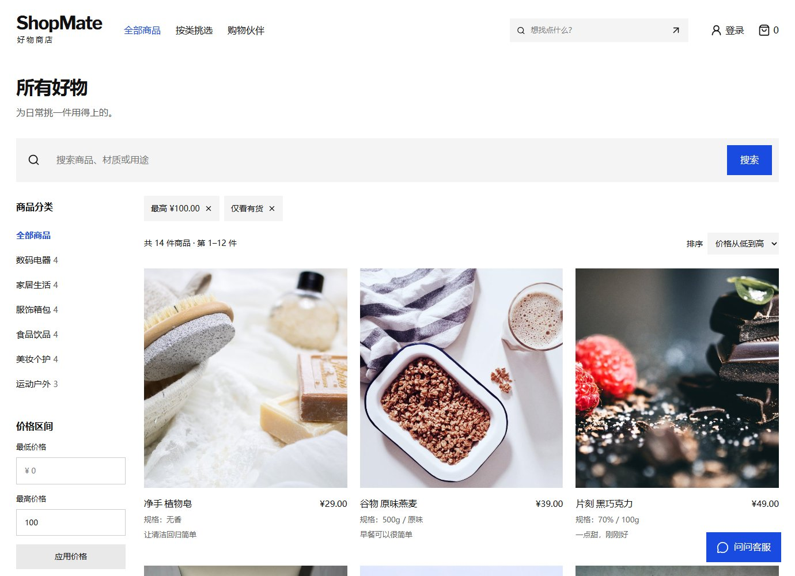
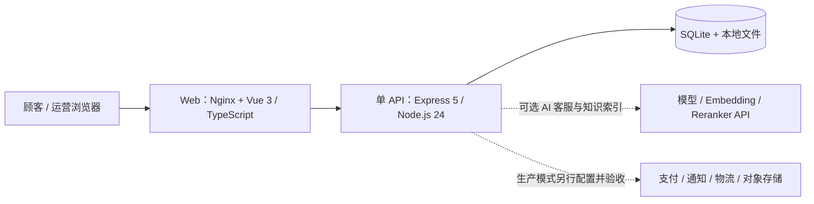
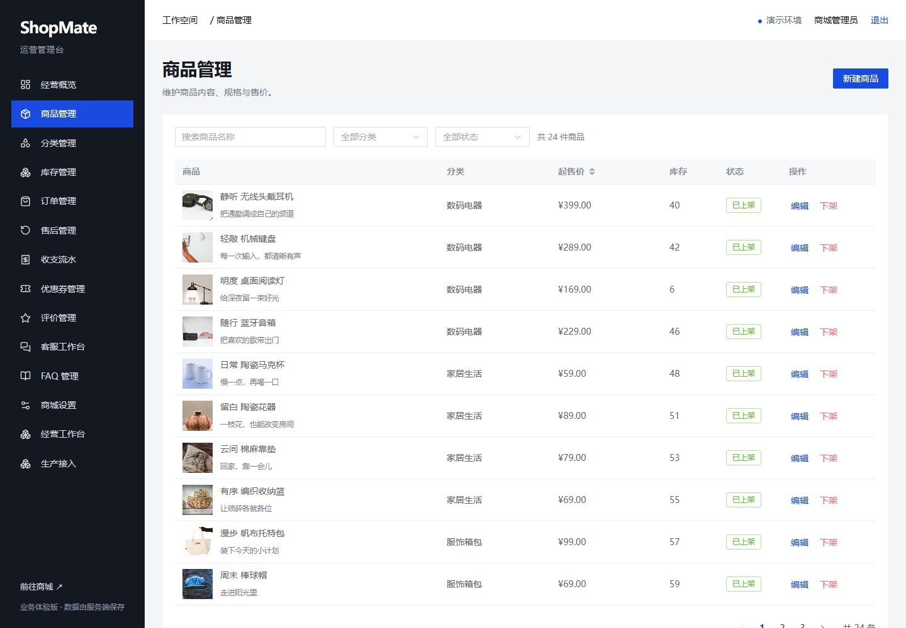

# ShopMate-AI

ShopMate-AI 是一个中文单店商城。顾客选规格、下单和申请售后，运营人员可以按仓管理库存、调拨、分包发货和退货质检，并按整单核对收退款。默认演示模式使用模拟交易；独立生产模式提供真实支付退款、物流、账号验证与运维接入。默认客服提供 FAQ 和人工回复，也可接入 AI，根据商品、本人订单和已发布的知识回答问题。


适合希望把商品、交易、售后和客服放在同一套系统中体验或继续开发的读者。订单、权限、库存与金额由确定的业务逻辑处理；AI 在这个基础上查找商品、本人订单和知识，不能自行越权修改交易。

| 使用方式         | 需要准备                               | 入口                                         |
| ---------------- | -------------------------------------- | -------------------------------------------- |
| 直接体验正式版本 | Git、Docker、Compose；Linux/amd64 镜像 | [公开 Packages 启动](#快速部署)，无需编译    |
| 修改后自建镜像   | 同上；访问基础镜像与 npm 源            | [源码 Docker 构建](#从源码构建)              |
| 热更新与调试     | Node.js 24、npm；PDF 功能另需 Poppler  | [宿主源码开发](docs/development.md#本地开发) |

## 快速部署

准备 Git、已启动的 Docker 和支持 `--wait` 的 Docker Compose。下面直接拉取公开的 API/Web Packages，无需安装 Node.js、npm 或自行编译；镜像适用于 Linux/amd64，Windows Docker Desktop 使用 Linux 容器。默认体验无需模型密钥。

### 1. 获取项目

```sh
git clone https://github.com/W205614/ShopMate-AI.git
cd ShopMate-AI
```

以下命令使用 v0.2.0 的公开 API 和 Web 镜像。固定部署可使用[镜像摘要](docs/releases/release-v0.2.0.md#镜像与对应源码)，对应源码附件见 [v0.2.0 Release](https://github.com/W205614/ShopMate-AI/releases/tag/v0.2.0)。如需查看匹配的源码，执行 `git switch --detach v0.2.0`。已有环境升级前请保留原配置和业务卷，并按[生产指南](docs/production.md)准备可验证的恢复资料。

在项目根目录复制配置模板。Windows PowerShell：

```powershell
if (-not (Test-Path .env)) { Copy-Item .env.example .env }
```

Linux 或 macOS：

```sh
[ -f .env ] || cp .env.example .env
```

### 2. 初始化配置

打开 `.env`，填写 `ADMIN_PASSWORD`，使用 10–128 位、至少包含字母和数字的密码。首次启动会创建管理员，用户名默认为 `admin`。已有部署请使用[密码维护命令](docs/development.md#账号维护)修改密码。

在同一 `.env` 中添加以下两行，选择已发布的镜像（公开拉取无需 GitHub 登录）：

```dotenv
API_IMAGE=ghcr.io/w205614/shopmate-ai-api:v0.2.0
WEB_IMAGE=ghcr.io/w205614/shopmate-ai-web:v0.2.0
```

### 3. 启动服务

Linux 首次部署先创建备份目录，供容器内的用户（UID/GID 均为 1000）写入。自定义了 `BACKUP_PATH` 时，请将下列路径换成实际目录，并确保父目录已存在。

```sh
if [ ! -e ./backups ]; then
  mkdir -m 0700 -- ./backups
  sudo chown 1000:1000 -- ./backups
fi
ls -ldn -- ./backups
```

已有目录先核对用途和权限，仅按需调整目录本身。Windows Docker Desktop 通常可直接启动。首次备份的可写性和恢复校验见[可靠性与运维](docs/reliability.md#正常运行和观测)。

```sh
docker compose pull api web
docker compose up -d --no-build --wait
docker compose ps
```

当 `api` 和 `web` 均显示 `healthy`，打开[健康接口](http://localhost:18086/api/health)，应看到 `{"status":"ok"}`。随后即可进入[商城](http://localhost:18086/)或[管理后台](http://localhost:18086/admin/login)。默认仅供本机访问，体验时统一使用 `localhost`。

启动失败时，用 `docker compose logs --tail 100 api web` 查看日志。端口占用、镜像源及公网访问配置见[开发与运维](docs/development.md)。日常停止用 `docker compose stop`，再次启动用 `docker compose up -d --no-build --wait`。业务数据在 Docker 卷中，`docker compose down -v` 会删除该卷。镜像摘要、源码材料和版本升级见[容器分发说明](docs/container-distribution.md)。

### 从源码构建

需要运行尚未发布的源码修改时，将 `.env` 的 `API_IMAGE` 和 `WEB_IMAGE` 分别设为 `shopmate-ai-api:local`、`shopmate-ai-web:local`，然后执行：

```sh
docker compose up -d --build --wait
```

构建需要访问基础镜像仓库和 npm 源；仅体验正式版本时使用上面的 Packages 启动入口即可。

## 生产版与外部接入

生产目标为 Linux Docker Compose、单店、单 API、SQLite。支持的供应商适配代码已包含在仓库中；后续在已实现的产品范围内填写配置、挂载凭据并完成平台开通及联调。真实账号、商户审核、公网回调和云资源需要自行准备。

| 能力                 | 已实现范围                                                        | 接入入口                                              |
| -------------------- | ----------------------------------------------------------------- | ----------------------------------------------------- |
| 支付、退款与渠道对账 | 微信 Native/H5，支付宝电脑网站/WAP；查单关单、异步退款、差异复核  | [支付配置](docs/integrations.md#微信支付)             |
| 账号与安全           | 邮箱或手机验证、找回密码、会话撤销、管理 TOTP MFA、资料导出及注销 | [账号与通知](docs/integrations.md#邮件短信与账号验证) |
| 物流                 | 真实运单录入、快递100订阅回调、查询和退货轨迹                     | [物流接入](docs/integrations.md#快递100)              |
| 图片与恢复           | 本地/S3 存储、显式迁移、快照与图片恢复集、远端上传下载校验        | [存储与备份](docs/integrations.md#图片存储与远端备份) |
| 经营与运维           | 商家和协议管理、HTTPS、只读监控、告警配置、维护发布与恢复         | [生产部署](docs/production.md)                        |

本地协议与功能验证已完成，真实平台接入按[验收清单](docs/integrations.md#本地验证与实网验收)进行。后台“接入状态”展示配置和运行数据。首次运行使用下面的演示流程；生产环境使用独立 `.env.production` 和生产 Compose，本机备份配置单独保留。

v0.2.0 源码提供生产用 Caddy 的构建入口。依赖修复、构建与镜像扫描见 [HTTPS 入口安全说明](docs/security/production-edge-security.md)。

微信 H5 支付链接遵循官方五分钟有效期；到期后先查单，再按原支付单号恢复链接，跳转前重新确认状态，详见[H5 链接刷新与限制](docs/integrations.md#h5-支付链接刷新)。

v0.2.0 支持一张订单按同一商家的多个仓库分配商品，顾客一次付款并按包裹确认收货。操作与迁移见[多仓库存与履约](docs/warehouses.md)，范围与验证见 [v0.2.0 发布说明](docs/releases/release-v0.2.0.md)。历次发布可从[文档导航](docs/README.md)查阅。

## 第一次体验

新商城已包含商品、分类和 FAQ。用第一笔订单体验顾客和运营人员如何配合：

1. 在商城[注册顾客账号](http://localhost:18086/register)。库存和价格筛选会显示符合条件的商品规格。选好规格和数量后，可在商品页选省份试算运费，进入结算后按实际地址与优惠重新报价。
2. 完成模拟支付并记下订单号。另开标签页，用刚配置的管理员账号登录后台。在“订单管理”找到订单，填入模拟承运商和单号后发货。运营首页可查看待发货、售后审核和人工接待的超时情况。
3. 回到商城核对物流并确认收货。若售后需要寄回商品或人工客服需要补充信息，可从置顶的待处理通知进入对应申请或会话。



开启 AI 客服前，按[模型配置说明](docs/ai-support.md#模型配置)了解会话与知识资料的外部处理范围。顾客可按商品或本人订单发起咨询。选购时可给出用途、预算和配送省份，由服务端核对当前有货且可配送的规格，点击卡片可打开对应规格。加购、取消待付款订单和申请售后均须顾客确认。v0.2.0 的代表性真实模型验收见[发布说明](docs/releases/release-v0.2.0.md)。

## 运行架构


```mermaid
flowchart LR
  Browser["顾客 / 运营浏览器"] --> Web["Web：Nginx + Vue 3 / TypeScript"]
  Web --> API["单 API：Express 5 / Node.js 24"]
  API --> DB[("SQLite + 本地文件")]
  API -. "可选 AI 客服与知识索引" .-> AI["模型 / Embedding / Reranker API"]
  API -. "生产模式另行配置并验收" .-> Providers["支付 / 通知 / 物流 / 对象存储"]
```

默认 demo 只需 API 和 Web 两个服务；SQLite 随 API 运行，不需要额外的数据库或 Redis。单写入节点的边界、事务和后台任务见[架构说明](docs/architecture.md)。外部服务虚线表示可选接入，未配置模型时仍能使用商城、FAQ 和人工客服。



商城首页和商品管理画面来自 v0.1.4 的隔离演示实例，商品筛选画面来自 v0.1.6 公开镜像的隔离实例。截图使用种子商品和合成配置。来源和图片许可见[素材说明](docs/assets.md#版本运行截图)。

## 从哪里读源码

```text
frontend/    Vue 商城与运营后台、浏览器测试
backend/     Express API、SQLite 事务、后台任务与后端测试
shared/      前后端共用的类型、API 契约和测试辅助代码
deploy/      HTTPS 与 Nginx 配置、生产和验收编排、监控模板
scripts/     仓库检查与宿主机维护脚本
docs/        开发说明、业务规则、验收报告和历史证据
.github/     GitHub Actions 验证流程
```

追踪刚才的下单流程，可从[结算页面](frontend/src/views/shop/CheckoutView.vue)进入[前端 API 调用](frontend/src/services/api.ts)，再看[后端 HTTP 入口](backend/src/app.ts)和[订单事务](backend/src/commerce.ts)。其他模块和脚本见[项目结构与阅读顺序](docs/project-structure.md)。

请求和数据流见[架构与运行边界](docs/architecture.md)，调用入口见[HTTP 接口总览](docs/api.md)。本地开发和测试见[开发指南](docs/development.md#本地开发)，生产发布从[上线核对](docs/production.md#上线核对)开始。

业务规则、AI 知识库、压测条件、故障记录及历史发布统一从[文档导航](docs/README.md)查阅。参与开发前阅读[贡献说明](CONTRIBUTING.md)；安全问题通过[GitHub 私密报告](SECURITY.md)提交。

## 许可证

原创代码和文档以 [MIT](LICENSE) 发布。第三方依赖、字体和照片保留各自许可，详见[第三方说明](THIRD_PARTY_NOTICES.md)与[图片署名](docs/assets.md)。正式版本、升级说明与已知限制见 [Releases](https://github.com/W205614/ShopMate-AI/releases)。
